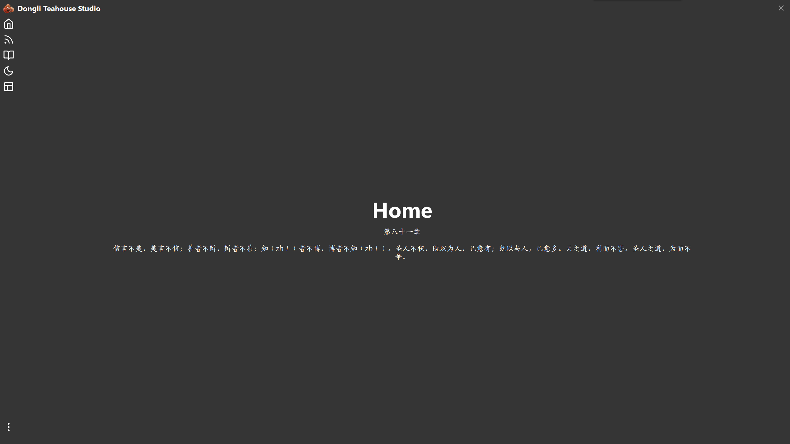
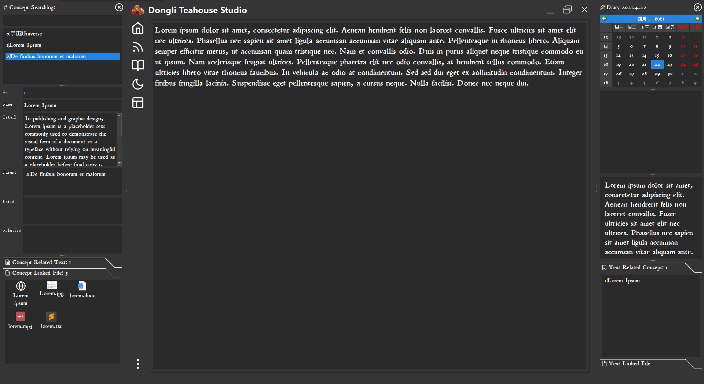
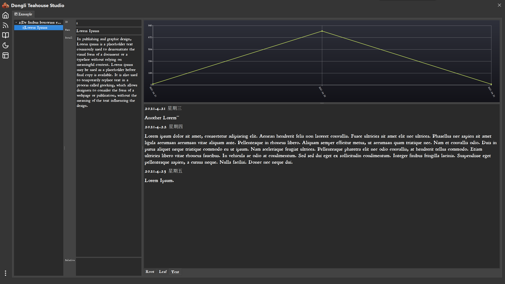

# 说明书

作者：鍵山狐\Holence

语言：简体中文

对应版本：1.0.0.1

## 前言

所有数据的修改都会在退出时自动保存，也可以手动保存按Ctrl+S。

除了一些文本编辑区，基本上没有撤销操作！所有的删除操作（除了File Library的删除文件会被移动到回收站）、编辑操作都是不可恢复的。

根目录下的Data文件可以分为四组：

- Concept_Data、Diary_Data、File_Data
- RSS_Tree_Data、RSS_Data
- Zen_Tree_Data、Zen_Data
- user_settings.ini

一组内的文件缺失将导致组内的其他文件出现问题

**请合理操作、养成备份的习惯！**

<u>标有星号的章节跟技术相关，如果若无兴趣了解，可以略过。</u>

## 登录

新用户在这里设置密码（大于等于六位）后点OK就行了


### 设置新密码

到Setting中Password一栏修改，点击Change重置即可。

### 加密解密*

用的cryptography的对称加密。每个密码对应固定的salt和key，然后用Fernet(key)对data文件进行加密解密，具体生成步骤如下：

```python
def generate_key(password):
	"""
	根据password生成一个固定的salt，用salt生成一个PBKDF2，用PBKDF2和password生成key
	所以给定一个固定的password，将返回那个固定的key。
	"""
	salt=password.encode()[::-1]
	password=password.encode()
	kdf=PBKDF2HMAC(algorithm=hashes.SHA256(),length=32,salt=salt,iterations=100000,backend=default_backend())
	key=base64.urlsafe_b64encode(kdf.derive(password))
	return key
```

### 登录时验证密码的方法*

设置密码的时候在ini文件中设置"password_checker"条目，条目的值为密码加密过的"Dongli Teahouse"：

```python
new_cheker=Fernet_Encrypt(self.password,"Dongli Teahouse")
self.user_settings.setValue("password_checker",new_cheker)
```

登录验证的时候再尝试用输入的密码解密，看是否能解密出"Dongli Teahouse"：

```python
if Fernet_Decrypt(self.password,self.cheker)=="Dongli Teahouse":
    #接下来启动程序
```

## 主窗体

第一次进来的时候是这样的


中间的部分是主窗体，两旁的是可拖动、重组、堆叠、漂浮、关闭的Dock控件。每一个Dock都是一个功能区，具体会在后面的篇章中介绍，我们先把它们都关掉，快捷键F5、F6、F7、F8。

点击最上面的Holo和最下面的三点可以召唤菜单，左键五个窗口按钮可以切换到对应的视窗，右键可以召唤出对应的菜单（Home按钮没有菜单）

我们先打开菜单中的Setting，去把字体换个好看一点的，在Font一栏设置就行了。

### Home

这里的welcome可以替换为自定义的随机文本，设置步骤如下：

打开菜单中的Setting，Random Text Directory一栏Open按钮，选定一个txt文件，OK保存设置。



每次打开软件时会展示txt文件中的随机文本块，点击Home下方的区域也可以手动随机更换。

其中txt文件内的标准格式：空行分隔文本块

```
第一章
道可道，非常道；名可名，非常名。无名天地之始，有名万物之母。故常无欲，以观其妙；常有欲，以观其徼（jiào）。此两者同出而异名，同谓之玄，玄之又玄，众妙之门。

第二章
天下皆知美之为美，斯恶（è）已；皆知善之为善，斯不善已。故有无相生，难易相成，长短相较，高下相倾，音声相和（hè），前后相随。是以圣人处无为之事，行不言之教，万物作焉而不辞，生而不有，为而不恃，功成而弗居。夫（fú）唯弗居，是以不去。
```

### RSS

一个RSS阅读器，不知道RSS是干嘛用的朋友可以看一下这几篇文章：

> https://www.runningcheese.com/rss-feed
>
> https://sspai.com/post/56391
>
> https://blog.ddlee.cc/posts/5768c6d/
>
> https://www.zhihu.com/question/423273154/answer/1594453657
>
> https://github.com/AboutRSS/ALL-about-RSS#an-image-to-explain-what-rss-is

---

右边藏了一个Browser，需要手动拖出来（QWebengineview是用代码动态生成的，这里splitter即使设置StretchFactor了也没效果）

右边藏了一个Browser，需要手动拖出来（QWebengineview是用代码动态生成的，这里splitter即使设置StretchFactor了也没效果）

Tree中的每个Feed前面标注的是未读文章的数目，文章列表中打勾的是已读文章，✨是未读的文章。


#### 添加文件夹

右键RSS的窗口按钮，Create RSS Folder。

#### 添加RSS Feed

右键RSS的窗口按钮，Add RSS Feed。


这里内置了标准RSS解析器（Feedparser），另外内置了Bilibili、Bandcamp、Pixiv、Instagram的解析器（具体输入格式我已经写在了框框里了）

注意Pixiv（的限制级用户）和Instagram的解析需要Cookie，在Setting中设置一下就行了

解析器会自动解析出Feed的名字，解析出文章列表并且按时间排序。

抓取的间隔为2秒，耐心等待吧~

#### 拖动排序

Feed可以拖放到Folder中，Folder会自动统计出未读的数目。

#### 编辑

选中单个文件夹按F2，编辑文件夹名或者标记文件夹内所有Feed文章全部已读。

选中单个或多个Feed按F2，编辑Feed名（不可批量），更新频率从周一到周日（可批量），Feed文章全部已读（可批量），Feed内已读文章删除（可批量）。

#### 删除

选中文件夹、Feed，快捷键按Delete。

#### Feed每日自动更新

默认设置不进行每日自动更新，想要每日自动更新的话可以去Setting中的第二页设置。

每次打开程序的时候会按照Feed内设置的更新频率（从周一到周日）运行每日更新，当日已更新过的Feed将不会再自动更新。

窗体左下角会显示正在更新的Feed。

如果不想要每日自动更新的，但希望手动运行每日更新的，可以右键RSS的窗口按钮，Start Daily Update Manually.

#### 手动更新选定的Feed

选中（可多选）按F4强制更新。

#### Feed \ Folder搜索

默认搜索的是Feed的名称


F: xxx或者f: xxx搜索文件夹名：


u: xxx或者U: xxx搜url：


#### 在默认浏览器中打开当前网页

按F10

#### RSS Data相关*

QTreewidget的column中的三格为：[rss_name,"RSS",rss_url]或[folder_name,"Folder",""]

RSS Tree的信息rss_tree_data存储在RSS_Tree_Data.dlcw中

```json
[
    {
        "folder_name": "A",
        "RSS": [
            [
                "Twitter @アニメ蟲師",//Feed Name
                "https://rsshub.app/twitter/user/mushishi_anime||Standard"
            ],
            [
                "minusT",
                "https://www.youtube.com/feeds/videos.xml?channel_id=UCEc2gctIynWHMDq2tuCBPJw||Standard"
            ]
        ]
    },
    [
        "Kingdom Come",
        "https://www.reddit.com/r/kingdomcome.rss||Standard"
    ]
]
```

Feed文章的信息rss_data存储在RSS_Data.dlcw中：

```json
{
    "https://www.youtube.com/feeds/videos.xml?channel_id=UCEc2gctIynWHMDq2tuCBPJw||Standard": {
        "type": "Standard",//不同的type，在程序中对应不同的抓取方式
        "feed_name": "minusT",//这个没多少地方用到，只会在每日自动更新show更新提示图标中出现
        "unread": 15,//未读数量
        "frequency": [//更新在星期几
            1,
            2,
            3,
            4,
            5,
            6,
            7
        ],
        "last_update": "2021417",//最后更新的日期，是一个ymd的字符串
        "article_list": [
            [
                "Eternal Night - part 1 trailer (Reimu vs Marisa)",//文章名字
                "https://www.youtube.com/watch?v=xTF9mPsQDjw",//文章url
                false,//已读or未读
                1618641323//添加文章的时间戳，展示文件夹中所有feed的文章时用
            ],
            [
                "[Touhou 3D] Eternal Night - part 0",
                "https://www.youtube.com/watch?v=xRSlq42_sUE",
                false,
                1618641323
            ],
            [
                "short preview",
                "https://www.youtube.com/watch?v=MQMPg_B_NsA",
                false,
                1618641323
            ],
            ...
        ]
    },
}
```


#### 添加新的解析规则*

1.custom_component中

```python
RSS_Updator_Threador中

    elif self.parent.rss_datarss_url=="NEWWEBSITE:
    	(Status,feed_name,update_link_list)=self.rss_parser.updata_NEWWEBSITE(rss_url)
        rss_url+="||NEWWEBSITE"

RSS_Adding_Getor_Threador中
	elif self.update_type=="NEWWEBSITE":
        (Status,feed_name,update_link_list)=self.rss_parser.updata_NEWWEBSITE(rss_url)

```

2.custom_function中

重要！！！update_link_list中较新的文章在列表的前面，旧的在后面

```python
RSS_Parser中

	def updata_NEWWEBSITE(self,rss_url,cookie=""):
		"NEWWEBSITE导入格式：https://"
		try:
			try:
				rss_name=
			except:
				#不符合格式
				return ("Invalid",None,None)

			url_list=[]
			article_list=
			
			for i in range(len(album_list)):
				url_list.append(
					{
						"title":article_list...
						"link":article_list...
					}
				)
			return ("Done",rss_name,url_list)
		
		except:
			return ("Failed",None,None)
```

3.dongli_teahouse_studio中

```python
rss_feed_add中
text+="已经内置NEWWEBSITE的什么什么，输入格式为http://"
combobox.addItem("NEWWEBSITE")
```

### Diary

这里按F6召唤出Diary Dock窗。



#### 写点什么

Ctrl+D在选中的日期新建一个文本块，在日历下方的文本编辑区写入内容（支持Markdown），所有的文本块展示在文本编辑区下方，点击进行选中编辑，可以拖放、Delete键删除。

#### 文本块链接Concept

按F5召唤Concept Dock窗。

在Diary Dock窗的文本块列表中选中要链接的文本块（支持多选），Ctrl+E，将链接Concept Dock窗中展示的Concept。

列表里的Concept是可以双击的。


链接的Concept将会展示在Text Related Concept中，取消链接可以选中文本块（不支持多选），再选中链接的Concept（支持多选），之后按Delete删除。

#### 文本块链接File

展示文本块链接的文件

文件相关见Library章节。

#### 文本块搜索

Ctrl+F搜索Diary。

用"&"分隔搜索关键词（如果要按链接Concept搜索，可以只打出Concept名称中被"|"分隔的部分），将会在文本块内容、文本块链接Concept中搜索并计算权重，默认按权重排列。


#### Diary-Concept时频分析

点击Analyze Diary with Concept功能，将统计设定时间内所有链接Concept数大于Threshold的文本块，并画出时频图与饼状图。

时频图操作（鼠标拖动、上下左右键移动，滚轮、加减号缩放，Ctrl键+滚轮水平缩放，Shift+滚轮水平移动。鼠标点击某段曲线，展示对应Concept对应的文本。鼠标靠近某个日期左键点击，下方的文本区会展示对应Concept对应日期的文本。）

自己摸索吧。

#### I'm Feeling Luck

随机跳转到某一天的日记，玩玩吧。

#### Diary Data相关*

```json
{//总共200年的容器
    //前面一直到1970年
    {
        "year": 2020,
        "date": [
            [],
            [],
            [],
            [],
            [],
            [],
            [],
            [],
            [],
            [],
            [],
            []
        ]
    },
	{
        "year": 2021,
        "date": [//12个月的容器
            [],
            [],
            [],
            [//每月动态插入日，插入后按day排序
                {//一天
                    "year": 2021,
                    "month": 4,
                    "day": 17,
                    "text": [
                        {
                            "index": 0,
                            "line_text": "Lorem ipsum dolor sit amet, consectetur adipiscing elit.",
                            "linked_concept": [
                                1,
                                0
                            ],
                            "linked_file": [
                                {
                                    "y": 2021,
                                    "m": 4,
                                    "d": 17,
                                    "file_name": ">Lorem ipsum - Wikipedia|https://en.wikipedia.org/wiki/Lorem_ipsum"
                                }
                            ]
                        },
                        {
                            "index": 1,
                            "line_text": "Aliquam dolor velit, aliquam ac mollis a, dignissim nec neque.",
                            "linked_concept": [
                                1
                            ],
                            "linked_file": []
                        }
                    ]
                }
            ],
            [],
            [],
            [],
            [],
            [],
            [],
            [],
            []
        ]
    },
	//后面一直到2169年
}
```


### Zen

一个内置的Markdown编辑、预览器，附带正则搜索功能（只在Edit界面）、Typora、Sublime快捷方式（可在Setting中设置启动位置）


#### 编辑模式 \ 预览模式切换

按F9

#### Segment \ Folder搜索

默认搜索的是Segment的名称

F: xxx或者f: xxx搜索文件夹名

t: xxx或者T: xxx搜Segment的内容

#### Zen Data相关*

QTreewidget的column中的两格为：[segment_name,"Segment"]或[folder_name,"Folder"]

Zen Tree的信息zen_tree_data存储在Zen_Tree_Data.dlcw中

```json
[
    {
        "folder_name": "A",
        "Segment": [
            "Test"
        ]
    },
    "Test2"
]
```

Segment的信息zen_data存储在Zen_Data.dlcw中：

```json
{
    "Test": "Test",
    "Test2": "Test2"
}
```


### Tab

树状展开Concept，并可以查看Concept的相关信息，并且展示出与Concept链接的文本块的汇总以及该对应时频图（鼠标拖动、上下左右键移动，滚轮、加减号缩放，Ctrl键+滚轮水平缩放，Shift+滚轮水平移动。鼠标靠近某个日期左键点击，下方的文本区会展示对应日期的文本）




#### 新建Tab


分别填上Tab的名称，根节点ID，从根节点向下深入的最大层数

#### 隐藏Tab

隐藏后tab信息仍然保存着，可以到tab菜单中恢复

#### 删除Tab

到tab菜单中删除当前显示的tab

#### 在Concept Dock窗中定位当前Concept

选中Concept Tree中的一个Concept节点，按F3定位

#### Root File

展示当前节点的关联文件

文件相关见Library章节。

#### Leaf File

展示当前节点下所有叶子节点的关联文件

文件相关见Library章节。

#### Tab信息相关*

存储在ini中了

```python
self.custom_tab_data=[
	[tab_name,tab_selection_id,tab_selection_depth,True],//名字，root ID，最大深入层数，展示or隐藏
	[tab_name,tab_selection_id,tab_selection_depth,True],
]
self.user_settings.setValue("custom_tab_data",encrypt(self.custom_tab_data))
```

## Dock窗

点击Dock窗左上角的图标可以查看对应的菜单（除了Sticker窗）

### QDockWidget换头术*

```python
self.dockWidget_concept.setTitleBarWidget(self.verticalWidget_titlebar_concept)
```

用一个它内部的widget替换掉不好看的头部，这里用了一个label去显示原本的标题，用了一个pushbutton去模拟关闭。另外为了使字母和pushbutton对齐，要设置包裹label、pushbutton的外层widget框的边距。

### QDockWidget加SizeGrip*

```python
QSizeGrip(self.frame_sizrgrip_concept)
```

超神奇的一句话，不用赋值，就产生了一个QSizeGrip。就是把那个frame排版到右下角很费劲。

### Concept


这里是所有Concept的搜索、管理区。

#### 新建Concept

Ctrl+N

#### 快速搜索Concept

Ctrl+R

搜索模式：


#### 添加Concept链接关系

当已经选中展示一个Concept时，选择目标Concept（鼠标点击Concept Dock窗的搜索列表中的某个Concept 或 点击到Tab页的Concept Tree中的某个Concept），再按Ctrl+1\2\3，分别会将目标Concept链接到源Concept的父辈、子辈、亲戚区。

#### 删除Concept链接关系

在Concept的父辈、子辈、亲戚区中选中，再按Delete键。

#### Concept链接文本块

自动展示所有链接了该Concept的文本块，双击会使Diary Dock窗定位到当日的文本块上

#### Concept链接文本块的（批量）编辑与迁移

鼠标点击Concept Related Text列表区域，按F2。说明已经写在上面了。


比如说你要把一个Concept链接的所有的文本块复制到另一个Concept下，那就输入目标Concept的ID，再把左边的文本块Ctrl+A全选，在拖动到右边，再按Copy Confirm，就行了。

比如说你要删除Concept链接的部分文本块，那就在左边选中后，按Delete按钮。

#### Concept链接File

展示Concept链接的文件

文件相关见Library章节。

#### Concept Data相关*

```json
[
    {
        "id": 0,
        "name": "宇宙|Universe",
        "detail": "",
        "parent": [],
        "child": [1],
        "relative": [],
        "az": "yz|universe",//用convert_to_az生成的
        "file": [
            {
                "y": 2021,
                "m": 4,
                "d": 17,
                "file_name": ">Lipsum|https://www.lipsum.com"
            }
        ]
    }
]
```


### Diary

已经在前面的Diary篇章讲过了

### Library

尝试拖动一个文件或者链接进去吧

然后弹出了这个警告窗口o(ﾟДﾟ)っ！


**为了用Concept管理文件，所有的文件都会以年月日的结构被存储在一个基地址下。拖动文件到Library区会自动把文件移动对应日期的文件夹下，而以往树状的文件存储结构将被图状的Concept代替，如果依旧喜欢使用树状文件存储结构的可以跳过这一章，并不要使用Library以及其他包含File的功能区。**


我们到Setting中设置一下基地址（这个基地址是可以迁移、改变的，只要基地址内部的结构没有被破坏，因为File_Data中记录的地址是相对地址，记录的是年月日与文件名）

#### 导入一个文件

拖动一个文件进去吧~

同样也可以在Concept Dock窗的Concept Linked File区 或 Diary Dock窗的Text Linked File区 或 Tab页的Root File区拖动入库，这将会自动进行链接操作


这个文件就被移动对应的目录下了。同时File_Data中也记录了这个文件的信息。

#### 导入一个链接

拖动一个网页链接进去吧~

同样也可以在Concept Dock窗的Concept Linked File区 或 Diary Dock窗的Text Linked File区 或 Tab页的Root File区拖动入库，这将会自动进行链接操作


但是在文件夹下面并没有这个文件啊？

而且文件名也不可能带有>或|或/的符号啊？？

其实这只是软件里的表示方法。网页的url是直接存储在File_Data中的。

#### 链接文件 \ 网页链接到Concept、Diary文本块

从Library区拖动文件 \ 网页链接到Concept Dock窗的Concept Linked File区和Diary Dock窗的Text Linked File区（可批量）

同样也可以从Concept Dock窗的Concept Linked File区 或 Diary Dock窗的Text Linked File区 或 Tab页的Root File区拖动到其他地方进行链接操作，很自由的，多试试吧。


#### 快速搜索文件

Ctrl+Q

搜索模式：

搜索为空：默认展示的当前日期的文件

搜索某日期的文件：


搜索链接Concept的文件：


搜索没有链接Concept的文件：


与条件搜索，用空格分隔：


#### 用默认应用打开文件

在Concept Dock窗的Concept Linked File区 或 Diary Dock窗的Text Linked File区 或 Tab页的Root File区和Leaf File区

直接双击

#### 在外部资源浏览器找到文件

在Concept Dock窗的Concept Linked File区 或 Diary Dock窗的Text Linked File区 或 Tab页的Root File区和Leaf File区

按住Alt双击

#### 修改文件名

在Concept Dock窗的Concept Linked File区 或 Diary Dock窗的Text Linked File区 或 Tab页的Root File区和Leaf File区

选中文件按F2

#### 删除文件

在Library中选中文件（支持多选），按Delete，所有与这些文件相关的链接信息将会被抹去，这些文件将会被移动到系统的回收站。

#### 复制文件到外部位置

选中文件，拖动到Library Dock窗内的文件列表中。

#### 内置图片浏览器

在Concept Dock窗的Concept Linked File区 或 Diary Dock窗的Text Linked File区 或 Tab页的Root File区和Leaf File区

按住Ctrl双击

（这个在查看Concept链接的图片的比较有用，当然你也可以全选所有的图片，再拖动他们到图片浏览软件中去）

#### 在Library中定位文件

在Concept Dock窗的Concept Linked File区 或 Diary Dock窗的Text Linked File区 或 Tab页的Root File区和Leaf File区

选中文件 \ 链接，按F3

这个功能发生在希望删除文件，又懒得再搜索框中打名字的时候。

#### 检查文件

点击File Check功能，说明已经写得比较详细了。

这个功能可以比对File_Data和基地址下的文件，比对出File_Data中缺失的文件或者基地址下多余的文件

可以从File_Data中抹去缺失的文件，可以把多余的文件添加到File_Data中（会被归属到对应的日期中）

也可以以新换旧，左边缺失的拖到左下方的列表，右边多余的拖到右下方的列表，一一对应替换。（这种情况可能发生在在外部批量重命名了文件）


#### File Data相关*

这里用Export的功能（Json.dumps）导出来的json文件不对，那里面的键全弄成str类型的了。

```json
{//总共200年的容器
    //前面一直到1970年
	2021: {
        1: {},
        2: {},
        3: {},
        4: {
            17: {
                "test.txt": [
                    0,
                    1
                 ]
            },
            9: {
                "test.jpg": []
            }
        },
        5: {},
        6: {},
        7: {},
        8: {},
        9: {},
        10: {},
        11: {},
        12: {}
    },
	//后面一直到2169年
}
```


### Sticker

就是一个便签，没什么

存在ini中了，没加密

```python
self.user_settings.setValue("sticker",encrypt(sticker_text))
```


## 显示

菜单中View一栏可以设置窗口显示样貌，也可以在系统右下角的托盘栏找到Holo图标右键快速设置。

### 全屏

F11

### 隐藏主窗口

漂浮状态的Dock窗依旧会漂浮，依旧可以从系统右下角的托盘栏找到Holo图标右键召唤Dock窗，这就是Dock窗的魅力！

### 恢复显示主窗口

在系统右下角的托盘栏找到Holo图标右键，Restore Main Window

### 置顶

主窗体、Dock窗置顶

### 混合使用

先在正常显示的状态下设置置顶，再隐藏主窗口，这样Dock窗就成了置顶漂浮的小工具箱了！

这是我最喜欢的功能！

## 数据

### 安全性检验

Data Security Check，检查是否有数据损坏。

### 导出

#### Export to Json

做了

#### Export to Epub\Pdf\Word

没做。需要的看看源码自个儿整吧

### 导入

没做。需要的看看源码自个儿整吧

## 设计遗憾与残留问题*

还是没有面向对象，还是一片混乱……

如果要用自定义window title、全部支持右键菜单的话，需要从最一开始就设计自制Mainwindow、Dialog、MessageBox类，之后所有的空间全部继承于这些。

现在发现全部抽象化或是一个个改都太费劲了，那就算了吧。

---

rss_tree_drop_update调用rss_tree_build后，滚动条跑到了最上面，怎么也设置不下来

adding_feed_thread如果被closeEvent打断，可能会卡死（可能是在接受网络数据的过程中）

File_Data、Concept_Data、Diary_Data中，如果缺失了其中的一个，另两个链接的文件信息缺失而且抹也抹不掉。

Zen Sgement Text Search如果结果多了会很卡……

---

File_Data中是用字典存储的，而删除、重命名是用index定位的，所以搞文件夹排到最前面有点麻烦，就不做了。

Concept Linked File和Text Linked File的File Data是列表，可以排序，每次添加文件进来的时候排序就行了。