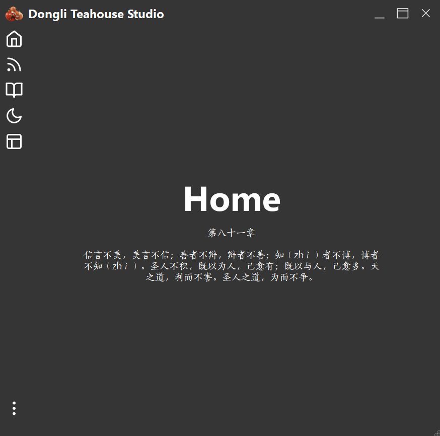
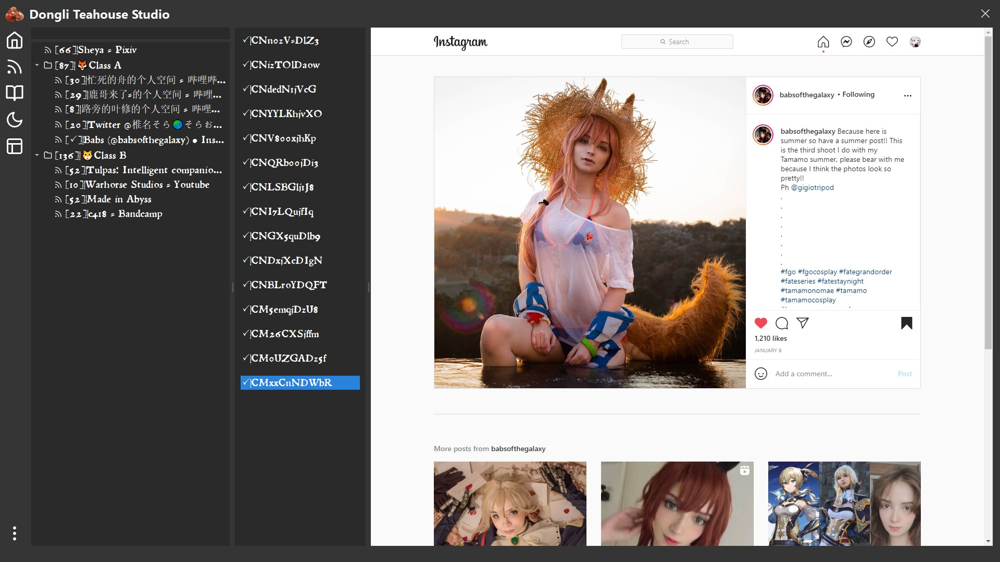
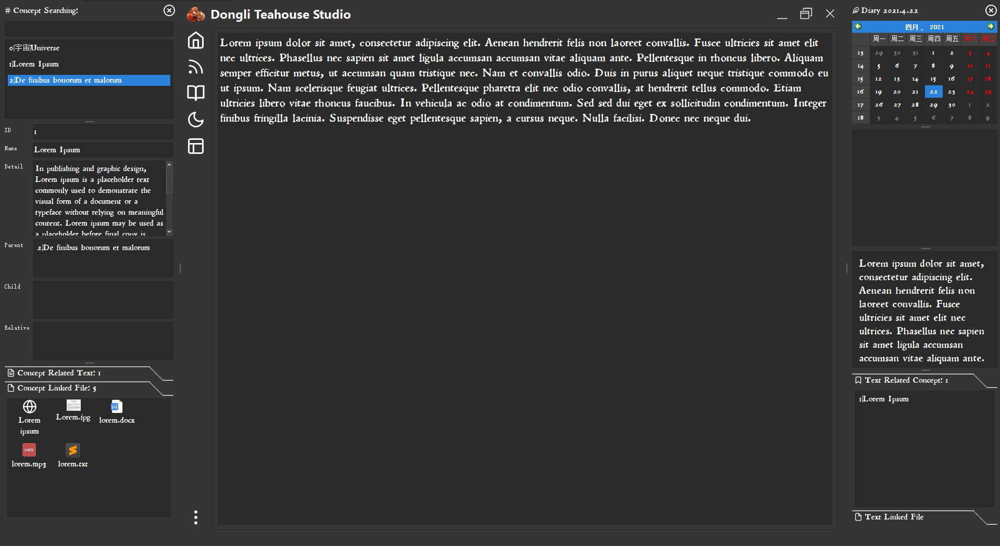
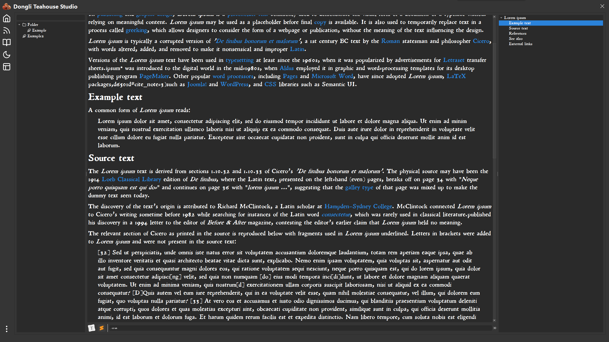
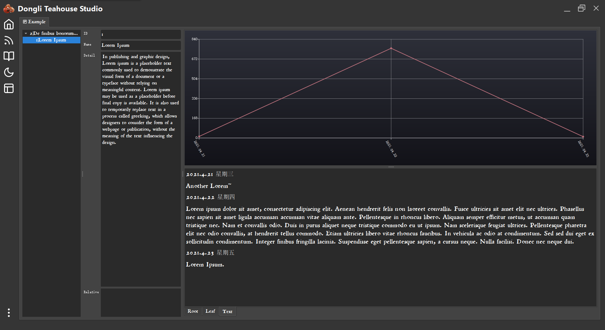
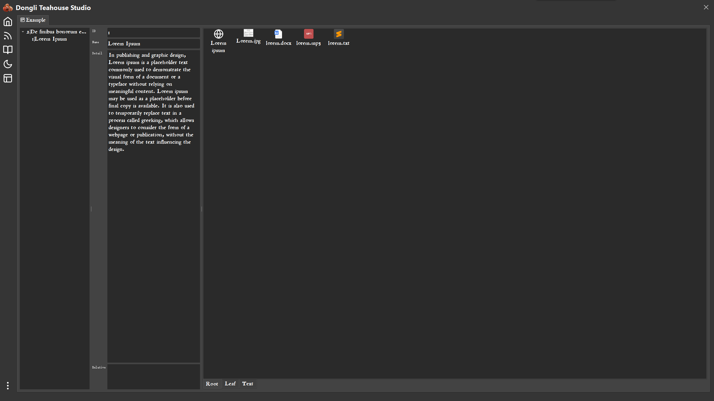

# DongliTeahouseStudio

This is a rough&clumsy demonstration of the real Dongli Teahouse Studio.

This project is deprecated at 2021.7.11. There is a [new version](https://github.com/Holence/DongliTeahouseStudio2).

---

Features:

- Manage files, links, diary with concepts (tag).
- Archive files under the folder tree of year/month/day.
- A simple RSS reader supporting parsing Standard RSS and some other sites which don't provide RSS Feed (such as Bilibili, Bandcamp, Pixiv, Instagram...)

---

---

Inspired By:

- Typora
- Wikidata
- Irreader
- RSSHub
- ...

---

TODO List:

- [ ] More export options
- [ ] ~~File right click context menu~~
- [x] A short manual

---

 

  

  

   

     

Next Dream...
